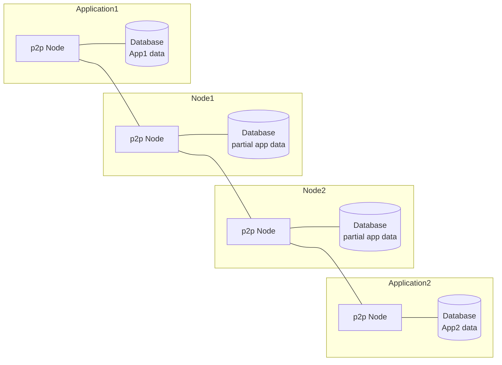

### What is Pistol?

Pistol is a fully peer-to-peer application framework.  There are no central servers or databases.  Data is replicated between nodes and can be delivered from one node to another providing reliability.  Unlike other P2P networks, the end application is also a node on the network.

**NOTE:  This is an early release of pistol, there is much work to do to make the protocol and storage more efficient.  There are many features to be added.  Use the current version at your own risk in a production environment.**

### Why use Pistol?

**Rapid Development**

Pistol is a great way to get an application up and running quickly (rapid development).  It is also a great solution for proof-of-concept (POC) and working prototype development due to its simple API design.  **With Pistol, you can stop worrying about server communication since all reads and writes are local to the app.** **You can develop a running app without a server at all since the app is a peer in the network.**

If you want to know more about this.  Look at or read more about the demo code below.

**Offline-first Applications**
Since Pistol does not require any server to operate, it is perfect for offline-first applications.

**Collabrative Software**

Pistol is perfect for collabrative software since everyone on the peer-to-peer network is sharing data automatically.

**Censorship Resistance**

Since there is no central authority, only the owner of an application can control what data is stored.  The owner of an application can also choose to release that ability so they can't control access to the application.  It is the choice of the person creating the application.

**Gaming**

Perfect for communication between game instances with them speaking P2P.

**Internet of Things (IoT)**

We are keeping the protocol as light as possible to make it possible to have peers on small low cost devices.

### How does security work without a central authority?

Pistol uses cryptographic proofs similar to the ones used in Bitcoin to verify you are you you say you are.  Pistol has a built in access control mechanism which allows you to say who can modify data.  Currently, users have the ability to own data that they write (first come first own) or to have world writable data.  Many more options are to come including group permissions.

For those familiar with these proofs.  Pistol uses a private/public key pair with cryptographic signing.  It stores the public key in the access control metadata to control who can write.  In the future we will be making this more efficient by having a key repository, but for right now, data has the public keys mixed in with the data.
